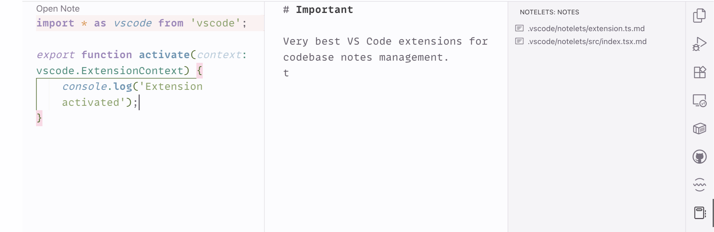

  

<h1 align="center">Notelets</h1>

 

Add sticky notes for your code — Markdown files alongside your project, organized by path.

**Install from [Visual Studio Marketplace](https://marketplace.visualstudio.com/items?itemName=nicksp.notelets) or [Open VSX Registry](https://open-vsx.org/extension/nicksp/notelets).**

## Features

- Add a note for any non-Markdown file with a single command or click.
- Notes are plain Markdown files stored under a configurable folder (defaults to `.vscode/notelets/`) mirroring your project structure.
- Fast, minimal, zero distractions:
  - CodeLens at the top of source files: "Add Note" / "Open Note".
  - Optional status bar indicator showing if a note exists.
  - Possibility to browse all notes in the workspace.
- Smart behavior:
  - Renaming a file renames its note.
  - Deleting a file deletes its note.
  - No notes for Markdown files or notes themselves (by design).
- Almost zero config; sensible defaults.

## Motivation

I wanted a coherent workflow where lightweight documentation lives with the code it describes using the familiar convenience of Markdown:

- Notes are plain Markdown inside your repo, version‑controlled with your code and reviewable.
- The folder mirrors your project structure, so a note naturally “belongs” to a file and travels with it on rename/move.
- No proprietary storage, no external sync, and works offline on any machine.
- Collaboration is simple: commit, push, review, and share with the team like any other code change.
- Minimal UI and zero lock‑in by design.

## Commands

You can run these commands from the Command Palette (<kbd>Cmd</kbd>+<kbd>Shift</kbd>+<kbd>P</kbd> on a Mac, or <kbd>Ctrl</kbd>+<kbd>Shift</kbd>+<kbd>P</kbd> on Windows).

| Description           | Name                | Default Mac | Default Windows |
| --------------------- | ------------------- | ----------- | --------------- |
| Open or create a note | `notelets.openNote` | —           | —               |
| Focus on notes view   |                     | —           | —               |

> [!TIP]
> [Bind a key](https://code.visualstudio.com/docs/configure/keybindings) to `notelets.openNote` for even faster access.

## Settings

You can change the following options in the [Visual Studio Code settings](https://code.visualstudio.com/docs/configure/settings).

| Description                                                | Setting                                                            | Default            |
| ---------------------------------------------------------- | ------------------------------------------------------------------ | ------------------ |
| Relative path to the root folder where Notelets are stored | [notelets.notesFolder](vscode://settings/notelets.notesFolder)     | `.vscode/notelets` |
| How to open notes: editor or Markdown preview              | [notelets.openBehavior](vscode://settings/notelets.openBehavior)   | `editor`           |
| Show a status bar item when a file has a Notelet           | [notelets.showStatusBar](vscode://settings/notelets.showStatusBar) | `true`             |

## How It Works

- For a file like `src/utils/math.ts`, its note will be created (by default) at:
  - `.vscode/notelets/src/utils/math.ts.md`
- Notes follow file renames and moves, and are removed when the source file is deleted.
- Notes are not created for Markdown files or for note files themselves.

## Changelog

The changelog can be found in [CHANGELOG.md](CHANGELOG.md).

## You May Also Like

Check out my other Visual Studio Code extensions:

- [Reveal on GitHub](https://marketplace.visualstudio.com/items?itemName=nicksp.reveal-on-github) — open the current project or file on GitHub

## Contributing

Bug fixes are welcome, but not new features. Read our [contributing guidelines](CONTRIBUTING.md) to learn more.

[Open an issue](https://github.com/nicksp/vscode-notelets/issues) on GitHub and [submit a pull request](https://github.com/nicksp/vscode-notelets/pulls).

## Authors and License

[Nick Plekhanov](https://plekhanov.me) and [contributors](https://github.com/nicksp/vscode-notelets/graphs/contributors).

<a href="[https://www.freepik.com/search](https://www.freepik.com/search)">Icon by Creative Squad</a>.

[MIT License](LICENSE.md).
